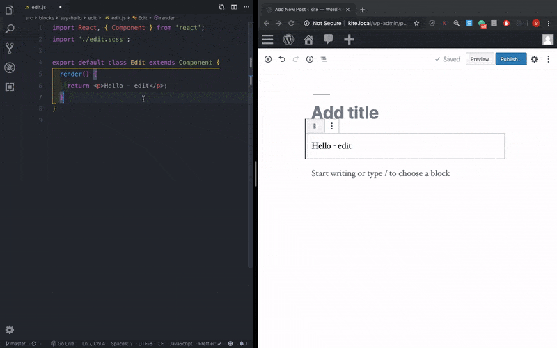
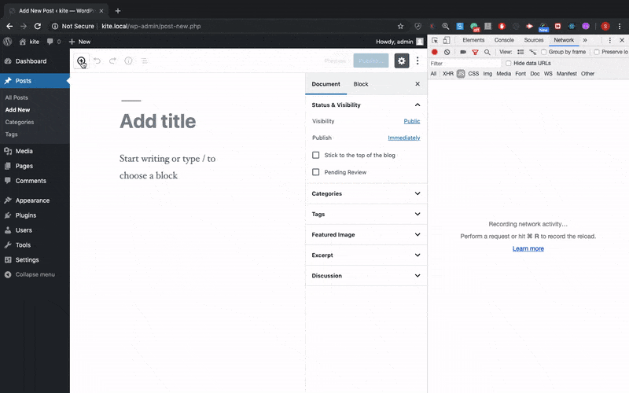

# develop-guten-blocks

A simple way to develop WordPress gutenberg blocks

This plugin provides easy way to develop WordPress gutenberg blocks.

### Plugin comes ready with _hot reload_ and _code splitting_ so that you don't have to worry about plugin slowing down the Gutenberg block.

> _Note: I have used npm 10.16.0 during development_

**How to Install the plugin?**

1. Clone the repository in your `wp-contents/plugins` folder

`git clone git@github.com:sudheer-ranga/develop-guten-blocks.git`

Replace all the instances that says **`dbg`** to what ever you want to name your plugin.

2. Install the dependencies

`npm install`

3. Watch for changes

`npm start`

### Adding a new block:

1. Create a folder in `src/blocks` with your custom block name.

2. Copy the `edit` and `save` folders that is present in `say-hello` block and change it according to your needs.

_The static block has an example implementation for RichText block_

## To build for production

1. Run `npm run build`

2. In the `plugin.php` file, comment those lines that points to `http://localhost:8000` and uncomment this line `plugins_url( 'build/'[filename], __FILE__ )`
